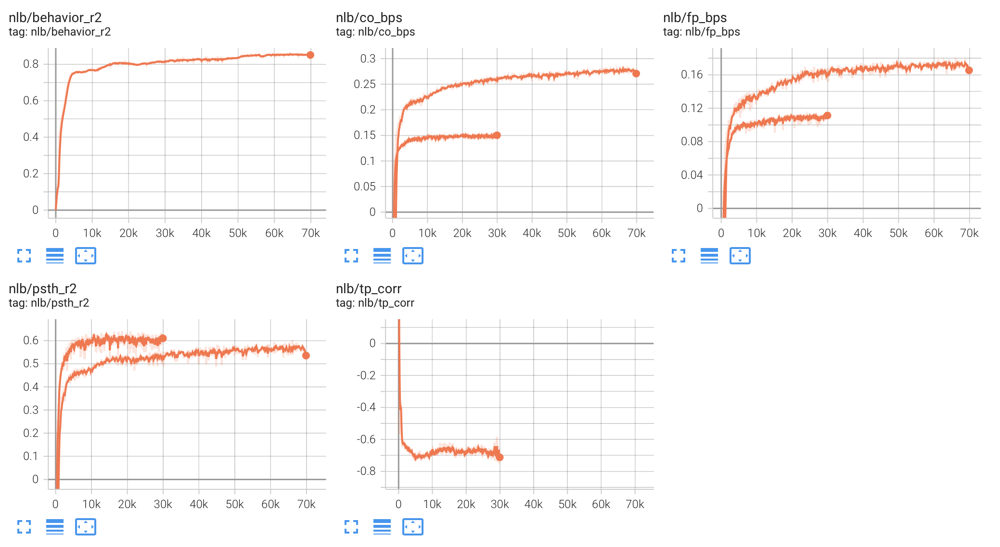
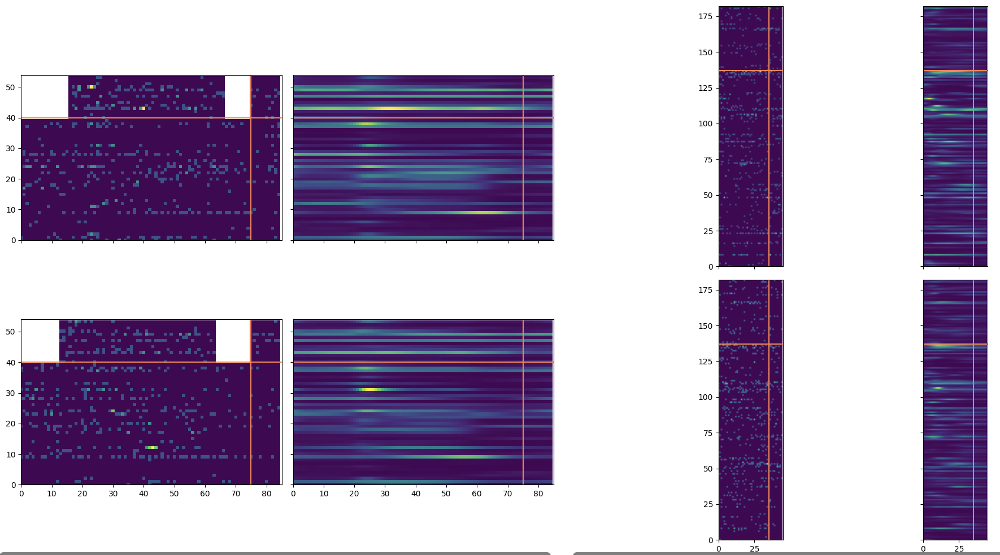
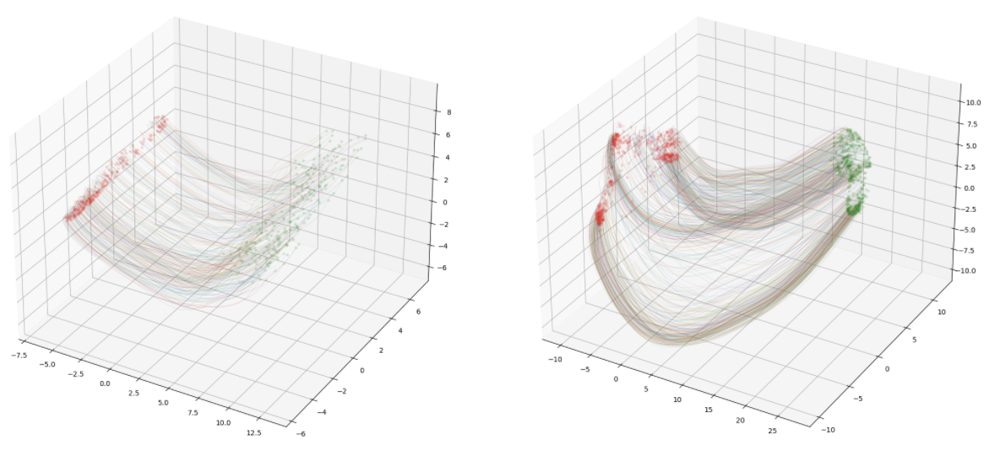

# PyTorch Lightning - Neural Latents Benchmark
PyTorch Lightning utilities that make it easier to train and evaluate deep models for the Neural Latents Benchmark. Key components include a preprocessing script, `DataModule`, example `LightningModule`, logging callbacks, and training scripts. The provided callbacks report competition evaluation metrics, inferred firing rate rasters, and latent state trajectories.

<p float="middle">
  
  
  
</p>

# Installation
Clone the entire `nlb-lightning` repo, including submodules. Then, create and activate a `conda` environment and install the `nlb_tools` and `nlb_lightning` packages.
```
git clone --recurse-submodules git@github.com:arsedler9/nlb-lightning.git
cd nlb-lightning
conda create --name nlb-lightning python=3.9
conda activate nlb-lightning
pip install -e nlb_tools
pip install -e .
```

# Usage

## Dataset Setup
### Downloading from DANDI Archive
First, install the `dandi` CLI (`pip install dandi`) and download each of the NLB datasets into the same folder (e.g. `dandi download DANDI:000128/0.220113.0400` for `mc_maze`). We will refer to this folder as `DATA_HOME`. Edit the `.env` file in the `nlb-lightning` repo to set this path appropriately. Download commands can be found on the DANDI Archive page for each dataset (links on the [NLB Datasets page](https://neurallatents.github.io/datasets)).

### Preprocessing
We define a `main` function in the `scripts/preprocess.py` module that preprocesses and saves data for training, using the functions in `nlb_tools.make_tensors`. This module can be run as a script to generate all 28 splits used for NLB. The preprocessed data will be stored in the `PREP_HOME` folder (edit `.env` accordingly), with a unique folder for each split (`{dataset_name}-{bin_width:02}ms-{phase}`). Within each split folder, the filenames used for each type of data are specified by `TRAIN_INPUT_FILE`, `EVAL_INPUT_FILE`, and `EVAL_TARGET_FILE` in `.env`. The `NLBDataModule` will load data directly from these files.

## Model Implementation
New models should be implemented as subclasses of the `pytorch_lightning.LightningModule`, as demonstrated in the `SequentialAutoencoder`. See the `pytorch_lightning` docs for more details. There are two requirements for compatibility with the datamodule and evaluation and plotting callbacks. If you are not using the callbacks, feel free to ignore these requirements.

1. On `val`-phase data, the `training_step` and `validation_step` methods should expect the batch to contain training tensors ordered as `heldin`, `heldin_forward`, `heldout`, `heldout_forward`, and `behavior`. On `test`-phase data, the `validation_step` batch will only contain `heldin`.
2. The `forward` method should have two input arguments (a tensor of heldin spikes and an integer number of forward steps) and two output arguments (a tensor of log-rate estimates, including heldin/heldout and observed/forward, and a tensor of latent states).

## Model Training
We provide an example training script for the `SequentialAutoencoder` at `scripts/train_sae.py`. Your script may be different, depending on the hyperparameters of your model and the specific callbacks or other `pytorch_lightning` features that you choose to use. Training logs and checkpoints will be stored in the `RUNS_HOME` directory that you specify in `.env`. Inside `RUNS_HOME`, each run will be stored at `{run_tag}/{data_tag}`, where `data_tag` is resolved using the f-string in the [Preprocessing section](#preprocessing). After training, the output of each model in a `run_tag` directory is written to a shared `submission-{phase}.h5` file, which can be uploaded directly to EvalAI.

For those with the resources to train multiple models in parallel, we provide a second training script (`scripts/train_sae_all.py`) which uses `ray.tune` to train a model on each of the 28 NLB splits and save all rate estimates to the relevant submission file.
